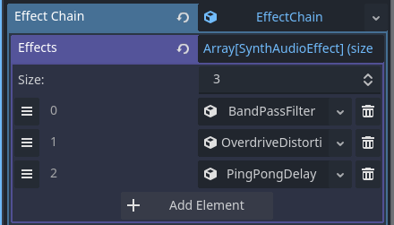

# Audio Effects

The Godot Synth Engine includes a variety of audio effects that can be chained together to shape your sound.

These audio effects are less optimized than the default Godot audio effects but these allow for modulation on the parameters.

> Modulation currently is a bit computationally intensive, only use when needed.

## Bus Effect routing

The sound configuration resource especifies an audio bus for the sound.
This allows for different sounds to be rounted into distinct audio busses for SFX or music.

> Godot has no limit on the number of audio busses, there's nothing and no one stopping you from creating an audio bus per sound.

The sound effects included with the Godot engine are very versatile and really good quality, also much more performant than the ones I wrote.

It is recommended to use the Godot audio effects when possible and only use the effects chain if a modulated effect is needed.

## Available Effect Types

### Filters

- Low Pass Filter: Attenuates frequencies above the cutoff point
- High Pass Filter: Attenuates frequencies below the cutoff point
- Band Pass Filter: Passes frequencies within a certain range
- Notch Filter: Rejects frequencies within a certain range
- Formant Filter: Simulates vocal formants
- Moog Filter: Classic Moog ladder filter emulation
- MS20 Filter: Korg MS-20 style filter

### Delay Effects

- Simple Delay: Basic delay line
- Ping Pong Delay: Alternating left/right delay
- Filtered Delay: Delay with filtering
- Multi-Tap Delay: Multiple delay taps
- Tape Delay: Tape-style delay with wow and flutter

### Distortion

- Clip Distortion: Hard/soft clipping distortion
- Waveshaper Distortion: Custom waveshaping
- Foldback Distortion: Signal folding distortion
- Bitcrush Distortion: Bit depth and sample rate reduction

### Spatial

> The reverb effect is currently disabled due to CPU performance.

- ~~Reverb: Room simulation with adjustable parameters~~

## Using Effects

The effect chain is an array of modulated effects wrapped in a resource.

This is to allow saving and loading of effect chain presets.

The effects in the array are applied in the order that they are.

Beware of very long delay tails as these are very computationally taxing.

If you require a sound with a long delay tail make sure you use the Godot delay audio effects instead of the modulated one.
