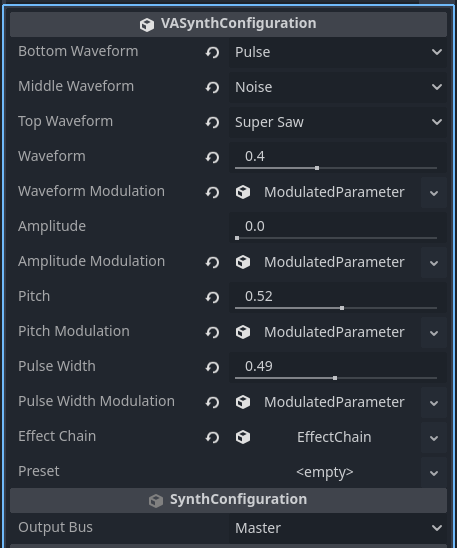

# Synthesis Engines

## Virtual Analog Synthesis

The Godot Synth Engine currently provides a Virtual Analog (VA) synthesis engine that simulates classic analog synthesizers.

### Features

- Multiple oscillator waveforms
- Waveform blending
- Adjustable pulse width
- Deep modulation capabilities
- Rich harmonic content

### Using the Virtual Analog Engine

Create a new VASynthConfiguration resource

The VA engine consist of 3 different wave shapes with a morph parameter.

Bottom waveform is at 0, mid waveform is at 0.5 and top waveform is at 1.

The amplitude parameter is set by default to an ADSR but that can be changed if needed.

Pitch controls the relative pitch, at 1 is the root note and at 0 is a 12 cent below.

Pulse width controls the lenght of the pulse or square wave.

### Available Waveforms

- Sine
- Square
- Triangle
- Saw
- Log Saw
- Exp Saw
- Pulse
- Noise
- Super Saw
- Sub Square
- Pulse Train
- Sine Fold
- Additive
- Sync Saw
