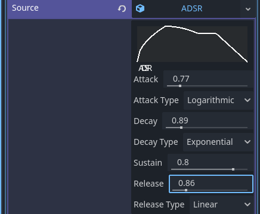
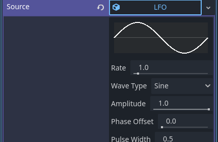
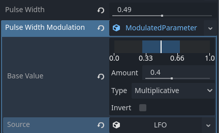

# Modulation System

The Godot Synth Engine features a powerful modulation system that allows you to create dynamic and expressive sounds.

## Modulation Sources

- **ADSR Envelopes**: Control how parameters change over time with Attack, Decay, Sustain, and Release stages

- **LFOs**: Low Frequency Oscillators for cyclic modulation

- **Velocity Tracking**: Modulate parameters based on note velocity
- **Keyboard Tracking**: Modulate parameters based on note position
- **Note Duration**: Modulate parameters based on how long a note has been playing

## Modulation Types

- **Additive**: Adds the modulation value to the base value
- **Multiplicative**: Multiplies the base value by the modulation value
- **Absolute**: Directly sets the parameter to the modulation value
- **Gate**: On/off control based on modulation threshold

## Using Modulation

Expanding the modulated parameter allows for control of the modulation source and depth.

The white bar in the visualizer indicates the base value, the blue area represents the modulated region.
