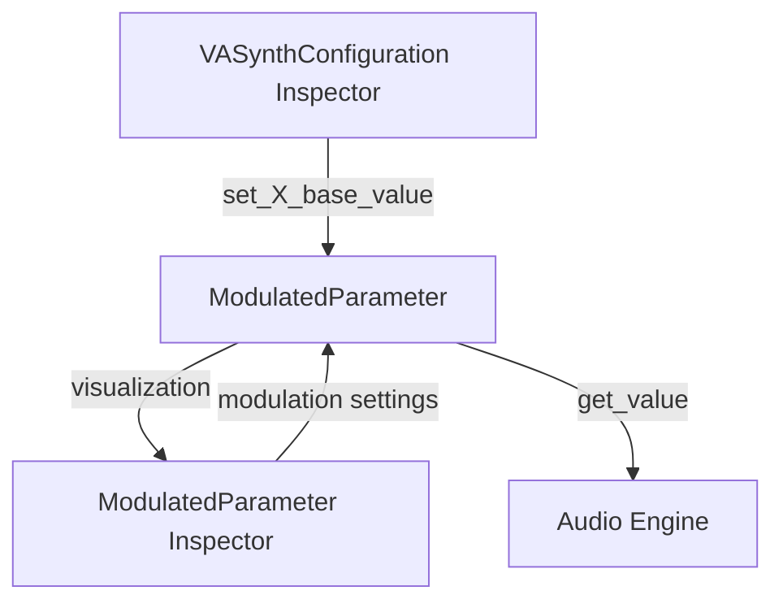

# Modulated Parameter Inspector Redesign Plan

## Current Issues

- Base value controls are hidden inside the ModulatedParameter inspector
- Min and max values are editable but should be defined by code
- Users need to expand the ModulatedParameter to adjust base values

## Solution Architecture

### 1. VASynthConfiguration Changes

- Add direct base value setters/getters for each parameter:

  ```gdscript
  set_waveform_base_value(value)
  get_waveform_base_value()
  set_amplitude_base_value(value)
  get_amplitude_base_value()
  set_pitch_base_value(value)
  get_pitch_base_value()
  set_pulse_width_base_value(value)
  get_pulse_width_base_value()
  ```

- These methods will directly modify the underlying ModulatedParameter's base value
- No additional state variables needed in VASynthConfiguration

### 2. ModulatedParameter Inspector Changes

- Keep the visualization component
- Remove the base value slider from the inspector
- Hide min and max value controls from the inspector
- Keep modulation controls (amount, type, source, invert)

### 3. Data Flow



### 4. Implementation Steps

1. **Modify VASynthConfiguration**
   - Add base value property bindings to the configuration class
   - Implement setters that directly modify the ModulatedParameter

2. **Update ModulatedParameter Inspector**
   - Remove base value slider
   - Hide min/max controls
   - Keep visualization component
   - Ensure visualization updates when base value changes

3. **Update Inspector Plugin**
   - Ensure proper property handling for the modified inspector

## Benefits

- Direct access to base values in the main configuration inspector
- Cleaner separation of concerns
- Better user experience with less nesting
- Proper encapsulation of min/max values
